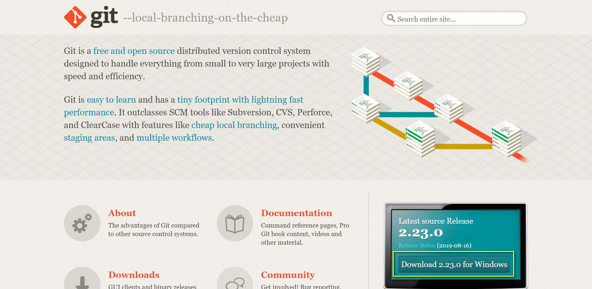
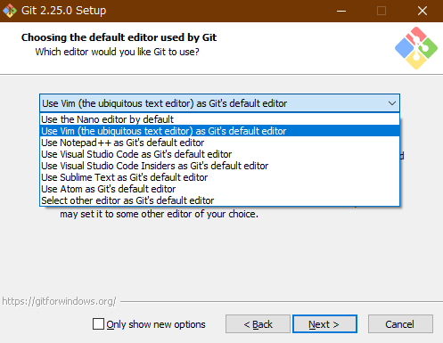

# この記事で学べること

* ソースコード管理ツールである`Git`をインストールし、社内gitサーバで公開されているソースコードをダウンロードする


# はじめに

`git`をご存知でしょうか？`git`とは「ソースコード管理フレームワーク」です。
後でもう少し詳しく解説しますが、要は**「改良を繰り返しながら更新されるプログラムのソースコードを、開発者にとっても使用者にとっても便利に管理しよう」**ということを実現する仕組みです。

近年ではプログラムのオープンソース化が大きな潮流ですが、`git`はこの流れを支える基盤技術の一つと言えるでしょう。`git`を使用することでプログラムの開発に多大な効率化が得られるだけでなく、そのプログラムの共有システムとしても素晴しい機能を果たすため開発者・使用者双方へ恩恵があります。  
例えば社内でのプログラムの開発と共有を`git`で行うことにより、社内全体の業務効率化・生産性向上に寄与することができます。ご存知のように様々なオープンソースのプログラムが`Github`のようなレポジトリサイトに投稿されており、これらのプログラムを使用したことがある方は多くいらっしゃると思います。

これだけ`git`が重宝されているのは、以下のような理由ではないかと考えています。

* ソースコードは修正されるものなので、無数のバージョンが作成されることになってしまう。  
この無数のバージョンを適切に管理するのは厄介だが、この問題に対して`git`は合理的な手法を提供してくれる。例えば、バージョンの異なるファイルでHDDの中を散らかさずに、やっぱり前の状態に戻したい時には1つのコマンドで一瞬で戻ることができる。
* `github`や`gitlab`のようなシステムが充実している。  
このシステムを用いると、開発者にとってはバージョン管理に手間をかけず最新版を含めたこれまでのバージョンのアップロードできるし、使用者にとっても簡単にダウンロードできる仕組みが提供され、双方にとって便利。
* 他のユーザからのフィードバックを受けやすい。他ユーザがソースコードの修正を行い、それを提案する仕組みが提供されている。

ということで、`git`を使えるようになるといい事ばかりですので、是非使えるようになりましょう。  
とは言えいきなりプログラム開発に`git`を使うのは難しいですので、本記事では`git`をダウンロードするためだけに使えるよう、インストールと基本的な使い方に絞って解説することにします。

# gitとは

`git`は、「バージョン管理システム」の一つです。バージョン管理システムとは、プログラムのソースコードなどの変更履歴を記録・追跡するためのシステムのことです。

他のバージョン管理システムとして、`subversion`などが挙げられます。`subversion`は集中型、`git`は分散型と呼ばれており違いがあるのですが、現時点で意識せずともいいでしょう。(もし詳しく知りたければ[こちら](http://success.tracpath.com/blog/2014/09/08/subversionとgitの違い/)を参照。)


バージョン管理システムは、変更履歴や現在の最新版などファイルの各バージョンをデータベースに保存します。このデータベースはレポジトリと呼ばれ、最終版だけでなくこれまで幾度となく変更されてきた前バージョンのファイルも、レポジトリ内に保存しているので昔に戻ることができるのです。
	
昔のバージョンのファイルに戻りたくなったことは誰しもあることでしょう。ワードやエクセルのファイルで、「変更してめちゃくちゃになったら困るから名前を変えて保存しておこう」など、まさに新しいバージョンを作成する行為です。

この方法は極めて単純で、旧バージョンを保存したいという目的は直接的に実現できますが、同時に様々なデメリットが存在します。

* 複数バージョンができた時どれが新しいのか、どこを変更しているのかなどが分からなくなる
* 違うファイル名が沢山できるので、別のところから参照していた場合にはそちらのファイル名も同時に直さなくてはならない
* 複数ファイルができて容量を圧迫する上、フォルダ内が散らかる

これらを解決できるのが`git`です。これらのメリットは「ダウンロードして使うだけ」のユーザにはあまり関係ないものばかりですが、開発者側にはかけがえのない恩恵ばかりです。そのため、ソースコードを配布する方法として、`git`をベースとしたサーバであることが増えているのです。

今はダウンロードだけできればいいので、「`git`を使うとなんか効率的な開発ができるらしい」、くらいの認識でもいいと思います。

# Gitのインストール方法

## ダウンロード

<p style="text-align:center;">
	
</p>

1. [こちら](https://git-scm.com)の「Downloadging Git」を押すとダウンロードが始まるので、終了したらダウンロードしたファイルを実行して下さい。

	* 現時点でのダウンロードファイル名は`Git-2.25.0-64-bit.exe`。32bitマシンの場合は32bit用のファイルをダウンロードしましょう。

## ライセンスの表示

<p style="text-align:center;">
	
</p>

1. ダウンロードしたファイルを実行すると以下の画面が出てきます。ライセンスが表示されます。`Next`を押して次に進みましょう。

## インストール時の様々な設定

<p style="text-align:center;">
	
</p>

1. インストールする時の設定を選択します。`Use a TrueType font in all console windows`はチェックを外すようにしましょう。

	* Additional Icons

		* デスクトップにgitのアイコンを配置します。

	* Windows Explorer integration

		* エクスプローラで右クリックした時、`Git Bash Here`と`Git GUI Here`を呼び出せるようにするか。この機能は便利なのでチェックしておきましょう。

			* Git Bash Hereは、Git版コマンドプロンプトであるbashをエクスプローラで開いているフォルダから実行できるようにする
			* Git GUI Hereは、Gitコマンドをグラフィカルな画面で管理することのできるソフトを起動できるようにする

	* GitLFS(large file Support)

		* バイナリファイルなどの大きなファイルを管理するのに適したファイル管理システムで、githubが中心となって開発しているgitへの追加機能。チェックしておいてよいでしょう。

	* Associate `.git*` configuration files with the default text editor

		* gitの設定ファイルである`.gitなんとか`(例えば`.gitignore`や`.gitconfig`など)をデフォルトのエディターに関連付けするか。お好みで。

	* Associate .sh files to be run with Bash

		* 拡張子がshのファイルをbashで起動するようにするか。お好みで。

	* Use a TrueType font in all console windows

		* これをチェックしているとフォントがLucida Consoleに変更されてしまうので、チェックしないようにしましょう。

	* Check daily for Git for Windows updates

		* 毎日アップデートの確認を行うか、ですが、普通の人はそんな必要はないと思うのでチェックを外しておきましょう。

## gitで標準的に使用するエディターの選択

<p style="text-align:center;">
	
</p>


ここではgitから呼び出されるデフォルトエディターを選択します。各種エディターが選択できますが、初期状態で選択されている`Use Vim`は**やめておきましょう**。

`vim`はlinuxでよく使用されている高機能エディターで、実は私も日常的に愛用しているのですが、いかんせん癖が強すぎてとてもじゃないがおすすめできないです。

一番普通のエディターに近いのは`nano`だと思いますので、こちらを選択しましょう。

メモ帳やサクラエディターを使いたい方は、インストール後に下記のコマンドを実行することで変更できます。インストール後に以下のコマンドをGit bashから入力することでエディターの変更が可能です。

```sh
# サクラエディターへ変更
> git config --global core.editor "'C:/Program Files (x86)/sakura/sakura.exe' -CODE=4"
# メモ帳へ変更
> git config --global core.editor "'notepad.exe'"
```

余談ですが、`select other editor as Git's default editor`を選択すれば任意のエディターが選べそうな雰囲気なのですが、私の環境ではハングしてしまい上手くいきませんでした。

## パスの設定

<p style="text-align:center;">
	
</p>

PATHの設定です。**RECOMMEND**となっているデフォルトの設定でよいでしょう。インストールするものにはgit本体のコマンドの他にunixで使われている様々な便利なコマンドもインストールされるのですが、それをコマンドプロンプトなどでも使えるようにするか、という設定です。

パスを通すとディレクトリ名を指定しなくてもコマンド名だけで使用できるようになります。よく使うコマンドについては便利ですが、別フォルダに同名のコマンドがある場合に問題が生じます。つまり、同名のファイルのどちらが使われるのか、という問題です。gitをインストールすることで作成されるファイルにwindowsと同名のファイルがあるため、パスを通すかどうかということを訊ねてきているわけです。

* 一番上は、Gitのコマンドプロンプトに相当する`Git bash`からしかこれからインストールするコマンドを使えないパス設定です。これは、gitコマンド本体も他のwindowsアプリケーションから使えないパス設定である、ということです。

* 二番目は、gitにとって最低限のコマンドのパスは通して他のアプリケーションからでも使えるようにして、付随的なunixコマンドのパスは通さない、という設定です。

* 三番目は、インストールする全てのコマンドのパスを通す選択です。これによってwindowsで使用されている同名のコマンド(find.exeやsort.exeなど)は使用できなくなり、gitでインストールされているファイルの方が使用されるようになります。

## SSH認証

<p style="text-align:center;">
	
</p>

SSH認証に使用するライブラリの選択ですが、デフォルトでいいでしょう。


## 改行コードの変換設定
<p style="text-align:center;">
	
</p>

改行コードの変換をどうするか、という設定です。今回はまずはgitでダウンロードしたい、という人向けですので**1番目の選択**をお勧めします。  
改行コードとは文字通り、改行を示すための記号なのですが、これがWindows,Mac(MacOSver9まで),Unixで異なっています。  
そのため、gitで管理されているコードがもし、Linuxで書かれていたとして、それをwindows使用者がダウンロードした場合には、改行コードが違うせいで上手く改行されない、という事態が生じてしまいます。  
このようなことがないように、1番目の選択肢では、Windowsで使用する時には自動でwindows用の改行コードに変換します。

詳細は[こちら](https://futureys.tokyo/what-is-autocrlf-of-git/)をご覧下さい。LinuxやMacを使用する人は二番目の選択肢などがいいと思います。

## git Bashで使うターミナルの設定

<p style="text-align:center;">
	
</p>

Git Bashを使用するターミナル(コマンドを入力する黒い画面のこと)の設定です。そのターミナルをMinTTYというものを使うか、windows標準のコマンドプロンプトを使用するか、という設定です。コマンドプロンプトよりもMinTTYの方が使い勝手がよいので、MinTTYを使う選択肢をお勧めします。

## その他

<p style="text-align:center;">
	
</p>

様々なオプションについてです。デフォルトのままでよいでしょう。Installをクリックして終了まで暫くお待ち下さい。

## 終了画面

<p style="text-align:center;">
	
</p>

無事終了すると以下の画面が表示されます。「Next」を押してインストールは終了です。


